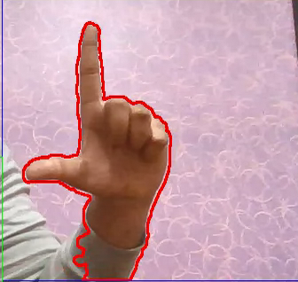

# Gesture_based_Game_Controller
#### **Asphalt 8** is one of the famous car game. it is really fun to play but as game has **fixed number of maps and less keys** the game becomes **tedious**. So this project is to improve the interaction between the game and user.
By the Use of the opencv for image preoccesing and pyautogui for virtual keyboard, Now you can control the car using the **Hand Gestures**.

There are 6 gesture used in game

**When both hand closed the car will simply auto accelerate**


when one hand is open and one hand is closed the car will go to that side 

**if left hand open and right hand closed car will take Left**


when you make the angle between the thumb and index finger greater than 80
**Car will drift according to the hand - if left hand car will drift and go left & vice versa**



when you do this with both hand you will enter the **Mouse mode**
in mouse mode the index finger of the right hand will move the mouse and openning right hand will click at current mouse position

**prerequisite**
```
In Asphlat 8 setting you have to change the keybord key with pyautogui keys to avoide error
Open Game go to Setting->controls->Select KeyBoard-> select custom
Now run the Asphalt_Keys.py

To run open Pythen terminal and type 

cd Gesture_based_Game_Controller
python Asphalt_Keys.py
```
**To use the code** 
```
cd Gesture_based_Game_Controller
pip install -r recquirements.txt
python switch_test_1
```
